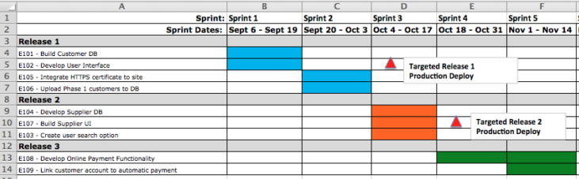

# **Product Owner’s Handbook**
## Guide For Scrum Product Owner

February 2018
Author: Atacan Demiralp

## Why I Wrote This Document

I needed a guidance to keep my knowledge in my head and take a quick look at to remember the role of Product Owner in Scrum. Also it was a good practice to read documents and blog posts of Product Owners in the Internet, bring them together, combine with my base knowledge and experience, and write my own brief summaries for various subjects. After I completed the document, I felt that I have learnt more and I should keep modifying this document because I  will keep learning too.

## References

http://www.scrumguides.org/scrum-guide.html
http://www.romanpichler.com/blog/
https://www.scrum.as/docs/International%20Agile%20Product%20Owner%20Foundation%20-%20Study%20guide.pdf
https://www.scrumalliance.org/community/articles/2014/december/order-your-product-backlog
https://www.scrum.org/resources/blog/tips-starting-product-owners

## Contents

1. [Definition of Product Owner](#definition-of-product-owner)
2. [What Product Owner Does](#what-product-owner-does)
3. [Characteristics of Product Owner](#characteristics-of-product-owner)
4. [Duties of Product Owner](#duties-of-product-owner)
	- [Step 1. Know Your Scrum Team](#step-1-know-your-scrum-team)
	- [Step 2. Create Product Vision Board](#step-2-create-product-vision-board)
		- [2.1. Product Vision, Strategy and Roadmap](#21-product-vision,-strategy-and-roadmap)
		- [2.2. Create Product Vision and Strategy](#22-create-product-vision-and-strategy)
		- [2.3. Validate Product Vision Board](#23-validate-product-vision-board)
		- [2.4. Review Product Vision Board](#24-review-product-vision-board)
	- [Step 3. Know The Stakeholders](#step-3-know-the-stakeholders)
		- [3.1. Create Stakeholders Map](#31-create-stakeholders-map)
	- [Step 4. Confirm Your Power](#step-4-confirm-your-power)
		- [4.1. Create Delegation Board](#41-create-delegation-board)
	- [Step 5. Determine What The Value Is](#step-5-determine-what-the-value-is)
	- [Step 6. Create Product Roadmap](#step-6-create-product-roadmap)
	- [Step 7. Create Story Map](#step-7-create-story-map)
		- [7.1. Create User Stories](#71-create-user-stories)
		- [7.2. Create Epics](#72-create-epics)
		- [7.3. Product Story Map](#73-product-story-map)
	- [Step 8. Create Release Plan](#step-8-create-release-plan)
	- [Step 9. Develop Product Backlog](#step-9-develop-product-backlog)
		- [9.1. Before Developing Product Backlog](#91-before-developing-product-backlog)
		- [9.2. Create Product Backlog](#92-create-product-backlog)
		- [9.3. Acceptance Criteria](#93-acceptance-criteria)
	- [Step 10. Sprint Planning](#step-10-sprint-planning)
		- [10.1. Sprint Characteristic](#101-sprint-characteristic)
		- [10.2. Sprint Planning Meeting](#102-sprint-planning-meeting)
	- [Step 11. Monitoring The Progress](#step-11-monitoring-the-progress)
	- [Step 12. Product Backlog Grooming](#step-12-product-backlog-brooming)
	- [Step 13. Sprint Review](#step-13-sprint-review)
	- [Step 14. Sprint Retrospective](#step-14-sprint-retrospective)
5. [Technical Debt](#technical-debt)

# Definition of Product Owner

Product Owner is the owner of product(s) who represents the interests and willings of the  stakeholders. 

# What Product Owner Does

Product Owner is responsible for ensuring clear communication of product and its functionality between the Scrum Team and stakeholders. PO is responsible for value delivered by the Scrum Team. Product Owner’s goal is to maximize the Return On Investment.

# Characteristics of Product Owner

Product Owner has to maintain both production view and stakeholder view. It is important to understand the needs and works of the Scrum Team, while also understanding and support ing the needs of the stakeholders. Stakeholders may contain customers, users and investors, therefore priority of the needs of stakeholders should be done carefully. On the other hand, Product Owner should know about the works of the Scrum Team to understand the opinion of the Scrum Team and make right decisions about product backlog, time and budget.

# Duties of Product Owner

## Step 1. Know Your Scrum Team

Product Owner needs a Scrum Master who is a guide, a mentor to ensure the Scrum is applied 100% correct, and the self-organizing Development Team which consists of people who have cross-functional skills. Since the Scrum Team can contains 9 members at most (according to the latest official Scrum Guide), it is good to know the teammates, their motivation and enthusiasm. Keep in mind that a Product Owner can perform in multiple Scrum Teams, however, it should not be a problem to know your teammates individually since the size of a Scrum Team is actually small.

## Step 2. Create Product Vision Board

#### 2.1. Product Vision, Strategy and Roadmap

The first stage in Agile Project is defining the product vision. Product Owner might have a product vision of a new product or sub-product. The product vision is the purpose for creating the product in one sentence.

Product Owner might not own the product vision. The vision might come from the top of the company.  Assume that the vision of company X is to sell cheapest flight tickets ever, so that everybody can fly.  Product Owner does not own the vision, but has a clear sense of what the vision is. If the vision is not clear enough to make a strategy and draw roadmap around it, Product Owner should (diplomatically) communicate that.

The product strategy might be to supply the cheapest airplanes, fuel, maintenance service, to have low-salary strategy and cooperate with agencies for advertisement. In this part, Product Owner can have the strategy.

The product roadmap is steps needed to make the cheapest flights and meet the requirements of the product strategy. Product Owner absolutely owns this.

#### 2.2. Create Product Vision and Strategy

The vision identifies a future state for the product when the product reaches completion. The vision focuses on the conditions that should exist when the product is complete. The board can be extended by adding columns, such as Market Opportunities, Competitors, Go-To-Market and etc.

Product vision specifies the What and Why of the product, while product strategy elaborates how to realize the vision with a specific approach, and provides a roadmap showing a timeline for executing the strategy.

**Example:**
- The Product Vision: To sell high quality natural and fresh daily milk
- The Main Goal: Become the highest chosen brand among the competitors in a year
- The Product Strategy:  Contact the best suppliers, consider about the logistics, daily and faster transportation needed, expand in the country

Avoid generalizations in the vision statement, such as “make customers satisfied” or “create a new IOS application”.

Goals should be measurable, time-bound objectives, such as “Increase revenue by 40% in a year” or “Gain 1 million mobile interaction in a year”.

Product Vision Board explains the vision, goals and the product strategy.

#### 2.3. Validate Product Vision Board

After the product vision board is determined, Product Owner validates it by asking the following questions:
1. Is this vision clear, focused, and  written for an internal audience?
2. Does the statement provide a compelling description of how the product meets customer needs?
3. Does the statement deliver value consistent with corporate strategies and goals?
4. Is the goal achievable?

These yes-no questions help Product Owner to validate whether the product vision is well-decided.

#### 2.4. Review Product Vision Board

Product Owner, first collaborates with the stakeholders and the Scrum Team, then review and revise the product vision board until everybody fully understands it. Product Owner makes sure that everybody has a copy of the Product Vision document and most of the boards and charts, such as the Product Vision Board, are physical and visible for everybody in any time.

## Step 3. Know The Stakeholders

#### 3.1. Create Stakeholders Map

Product Owner is the one who represents the stakeholders in the Scrum Team. He/she should understand and manage his/her stakeholders. Product Owner should involve the right stakeholders to maximize value delivered to the customers, because the decision on the product vision, roadmap and value of the product are confirmed together. To gain insight of stakeholders, Product Owner may use a “stakeholder map”. It is good practice saying how to engage with them. According to their interest and power, Product Owner may decide which stakeholder needs more care and engagement. Maybe sponsor is more important than customer, maybe investor opinions should be taken care first. The communication method may change according the power of the stakeholder.

## Step 4. Confirm Your Power

#### 4.1. Create Delegation Board

Product Owner makes his/her mandate clear by involving stakeholders. He/she defines his responsibilities and gets confirmation of stakeholders. This is important to decide it in very early stage to prevent possible communication deficiencies and arguments in the future. By using Delegation Poker, it is easy to decide who is responsible for what in what level, also beneficial to encourage employee engagement through controlled self-organization. To learn more about Delegation Poker: https://management30.com/product/delegation-poker/

Product Owner decides the responsibilities with the stakeholders together. There are some questions needed to be asked to create the Delegation Board:
- Who is needed to define, change or pivot the product vision?
- Who is needed to define, change, pivot or remove business goals?
- Who is needed to add, define, change or remove items from the Product roadmap?
- Who is needed to add, define, change or remove items from the Product Backlog?
- Who is needed to add, change or remove people from the Scrum Team?

## Step 5. Determine What The Value Is

The definition of the product value depends on the the product. Products have different types, life time, metrics and etc, therefore measuring the product value is not same for every product. Product Owner decides definition of value with the stakeholders together. The questions to be asked:
- What is valuable for the product?
- What is valuable for the customer?
- What is valuable for the development process?

After answering these questions, Product Owner can come up with how to measure the value of the product. The value may change over time since the technology, market and customer behavior may change.

**Example Values:**
- Functionality:
	- A photo editor mobile application that offers Adobe Photoshop functionalities.
- Reliability:
	- A VPN application that never loses the connection while running in background.
- Usability:
	- A music player that is easy to use with only one button.

## Step 6. Create Product Roadmap

The product roadmap displays a story of how the product grows. It contains releases built on the previous builds. The product roadmap must include time bounded releases. Going agile does not mean that you do not need specific deadlines. This is a mistake done by many agile teams even in very huge companies. The deadlines are “must”. The release dates Product owner has to have product roadmaps with release dates. This roadmap will talk to development, marketing, sales, and other groups to carry the product to the success.

Product Owner keeps the roadmap simple and easy to understand. He/she focuses on the goals. 

The release dates/timeframes are estimated according to the past projects/products and their accuracy If the organization uses agile for first time, it is not possible to foresee the releases dates since the agile is based on empiricism. In this case, release timeframes can be determined as 3 months at most. It is better to release more often because every releases returns a real feedback. Product Owner makes the roadmap goal oriented and measurable.

## Step 7. Create Story Map

Story Map is similar to Product Roadmap. Product Owner may use either one of them or both. It includes not only the features but also the epics and user stories. So, user stories and epics can be written by anybody, but the confirmation belongs to the Product Owner. By arranging a Story Writing workshop, user stories and epics are created by the Scrum Team and the stakeholders (if needed). 

#### 7.1. Create User Stories

User story is the small unit of work agreed by the stakeholders and the Product Owner. They are written in the form of “As [persona], I’d like to [do something], so I can [do something]”. 

**Example:**
- As a customer, I’d like to reset my password, so I can log in the system.

#### 7.2. Create Epics

Epics are nothing but bigger user stories. Some user stories may have dependencies on other user stories to be completed. The business value of some stories cannot be realized until the entire big story is complete. This kind of big stories are called epics. 

**Example:**
- As a customer, I’d like to create an account, so I can use the system.

The previous user story is related with this user story, because in order to reset the password, user first needs to have an account in the system. Therefore these two user stories belong to the same epic, let’s call it “As a customer, I’d like to manage my account”.

## 7.3. Product Story Map

Product Owner writes the release goals, release features, epics, and user stories on sticky notes. Then places them into the right places on the Story Map. It is similar to the Product Roadmap. The purpose is to see release goals, features, and what to do to achieve the features done.

A sample of Story Map of one release:

A sample of Story Map of all releases in the Product Roadmap:

## Step 8. Create Release Plan

Release Plan is very similar to the Product Roadmap and Story Map. The difference is it simply shows which release contains which user stories and how much time.

**Example:**

## Step 9. Develop Product Backlog

Product Backlog is an ordered list of user stories, and epics to be needed to develop the product. The Product Owner is responsible for the Product Backlog, including its content, availability, and ordering. All user stories, and epics are pointed with an ID number.

Product Backlog is dynamic and never complete. As the product needs change to be more competitive and useful, the product backlog changes too. As long as the product exists, the product backlog also exists. As the product returns feedback, new requirements or updates are added into the Product Backlog. It contains all features, requirements, updates, and fixes for the future releases. Product Backlog items have the attributes of a story, priority, estimate, and “Done”.

#### 9.1. Before Developing Product Backlog

For the sprint planning meeting, the product backlog items should be prepared. To prepare them, Product Owner may perform as User Researcher to collect data. Brief summaries about the user research take places under Product Design label in my blog (https://www.atacann.com/blog/category/Product%20Design) User research gives Product Owner insights of product users. If the organization has a full time user researcher, Product Owner may ask him/her to perform a user research to see what the customer really want or need. Product Owner should derive the product backlog items from the product roadmap/story map by combining the outcome of the user research.

#### 9.2. Create Product Backlog

Product Owner lists the Product Backlog items. Higher ordered items are usually clearer and more detailed than lower ordered ones.

The items can be prioritized either as high, medium and low importance, or as must-have, should-have, and could-have (also won’t have) tags. Must-haves defines the minimum viable feature set. This method is called MoSCoW method.

**Example:**
- Development team estimated and Product Owner has decided to let the next Product Backlog item takes 2 sprints. After 2  sprints, if the all must-haves and should-haves are developed, tested and defined as “Done”, then the team can move on the next backlog item.

While ordering the items, Product Owner places the items which has more business value to the top of the Product Backlog. How is that value foreseen?
- The backlog item may be directly related with ROI.
- The backlog item may be the prior need of the most important stakeholder.
- The backlog item may be curial to implement first, because other items are dependent on it.
- The backlog item may have a great impact
- The backlog item may have risk and uncertainty.

If Product Owner thinks that multiple items have the same value, he/she considers about the cost of the item and places item with more Value/Cost ratio to the upper row.

According to Pareto Principle, 80% of the effects come from %20 of the causes. In this case, Product Owner knows that 80% of value will be delivered by 20% of the product. The stories  that probably deliver the highest value are more significant than other stories.

**Note:** The example Product Backlog below contains imagined assumptions.

In the Sprint Planning meeting, the estimate columns will be filled and the order of backlog items will be updated if needed. Done section of a story will be labeled as Done if and only if the item fits the Definition of Done.

## 9.3. Acceptance Criteria

Product Backlog items needs an Acceptance Criteria which provides clarity to the Scrum Team on what is expected of a User Story and remove ambiguity from requirements. Product Owner defines the Acceptance Criteria. INVEST system can be used for this criteria.

## Step 10. Sprint Planning

#### 10.1. Sprint Characteristic
Time boxed event which lasts 2 - 4 weeks, where usable, potentially releasable and “Done” product increment is created.
The focus is to meet the Sprint Goal.

Product Owner and Development Team re-negotiates on the scope of the product as the product grows.
Sprints enable predictability by ensuring inspection and adaptation of progress toward a Sprint Goal at least every calendar month.

Product Owner can cancel the Sprint before the time box is over if the Sprint Goal becomes obsolete. When a sprint is cancelled, any completed and "Done" Product Backlog items are reviewed. Product Owner checks if part of the work is potentially releasable. Incomplete items are re-estimated and put back on the Product Backlog.
Product Owner knows that sprint cancellation wastes resources, because a new sprint should be designed again.

#### 10.2. Sprint Planning Meeting
In 8 hour-meeting (for one month sprint), Scrum Team negotiates and plans the works to be done in the sprint. Main questions to be asked:
1. What can be delivered in the Increment resulting from the upcoming Sprint?
2. How will the work needed to deliver the Increment be achieved?

Scrum Team collaborates on understanding the work to meet the sprint goal. The input to this meeting is the Product Backlog which is prepared by Product Owner, the latest product increment, projected capacity of the Development Team and past performance of Development Team. In the first of the meeting, the items of the Product Backlog are estimated by Development Team. To achieve this, Product Owner may suggest to play Planning Poker.

First, Product Owner reads an Product Backlog item. Then, asks the Development team how much time it takes. Development Team is the estimator. Estimators discuss the item,  When the discussion is over, all the estimators shows their Planning Poker cards. The cards have the Fibonacci numbers (1, 2, 3, 5, 8, 13, 20) on it, representing the number of story points, not hours or days. Each estimator has only one card and all estimators reveal their cards at the same time. Estimators observes all the cards and see the estimates. If all the cards don’t have the same number, a new discussion is made over again. The game is repeated until all the cards have the same number for a backlog item. After Product Backlog is filled with estimations, the first part of the meeting ends.

In the second part of the meeting, Development Team picks items from the Product Backlog into Sprint Backlog. Sprint Backlog contains selected product backlog items and the plan for delivering them. Development Team decides how many story points they can take into the Sprint Backlog. They separates the chosen items into smaller tasks. Sprint Backlog includes sections, such as “To-Do”, “In Progress”, “In QA” and “Done”.

Development Team picks the items from the Product Backlog according to their story point capacity in a sprint. They convert the Product Backlog items to Spring Backlog items. Development Team is responsible for specifying the tasks, moving the tasks from a cell to another cell, performing the development, updating the Spring Backlog, monitoring the progress, and noting the impediments for Scrum Master. By deciding the sprint backlog, the sprint goal is also decided.

**Example:**
- Chosen Backlog Item: As a user, I’d like to create an account and login the system.
- Sprint Goal: Implement account creation functions for the system.
	- Task 1: Implement sign-up page and functions.
	- Task 2: Implement login page and functions.
	- Task 3: Implement “forgot my password” page and functions.
	- Task 4: Implement e-mail confirmation functions.
	- Task 5: Add the new account into the database.
- Definition of Done:
	- Code builds without warnings
	- Code unit tested
	- QA returns no bugs
	- Built uploaded to Github

Definition of Done is defined by Development Team, because they are the ones who will create the Increment. Scrum Master and Product Owner confirm the definition. If there are multiple Development Teams working on a product, they must have a common Definition of Done.

Here an extended Scrum Board that I made in Photoshop:

## Step 11. Monitoring The Progress
Once the Sprint has begun, Development Team and Product Owner are responsible for tracking the progress by Burn-down charts. Development Team is self-organized and responsible for managing their work. Therefore, monitoring the progress of a sprint belongs to the Development Team. In the big picture, Product Owner monitors how much work is done and how many Product Backlog item marked as Done. Burn-down chart displays the remaining work to do.

**Example:**
- Development Team picks 60 points of story for a 2-week (72 hour) sprint. A sample of burn-down chart of Sprint Backlog:

Velocity is the total story points done in a sprint. Velocity is calculated after a sprint is done. In this graph, the velocity might be the measure of previous sprint or the the overall velocity of all previous sprints. Velocity can change 10% up or down in each sprint. We see that the Development Team is used to done 60 points story in more than 80 hours.
The burn-down line shows how many story points is still remaining to do. In the graph, we see that in the first 6 hours no task has met the Definition of Done.

Product Owner keeps the same graph to see the progress in the product. Instead of hours, the graph has sprints. So, how many story points can be Done in a sprint is seen by the Product Owner.

A sample of burn-down chart of Product Backlog:

Product Owner should track the velocity of the Development Team over the sprints at least least every Sprint Review, because it is important for estimations in Release Plan.

## Step 12. Product Backlog Grooming
Product Backlog grooming which is also knows as backlog refinement, is the act of editing order and estimate of the backlog items. Product Owner and Development Team collaborates and consider about the details of the Product Backlog items. During the grooming, Product Backlog items are reviewed and revised. Backlog grooming should not take more than 10% of the capacity of the Development Team. When and how the backlog grooming is done is decided by the whole Scrum Team. Usually the grooming session take place in the middle of the sprint.

## Step 13. Sprint Review
At the end of each spring, a Sprint Review meeting is held to inspect the Increment, built by  Development Team. The participants are the Scrum Team and the stakeholders. This is an informal meeting to get feedback on product.. It takes 4 hours at most (for one-month sprint). 

- Product Owner explains which Product Backlog items are Done.
- Development Team discusses what went well, what problems occurred, how the problems were solved.
- Development Team demonstrates the Increment and answers the questions about it.
- Product Owner points the current Product Backlog as it stands, then discusses about the delivery date based on the current progress.
- Attendees focuses on what to do next.
- Attendees review the current business conditions
- Attendees review the timeline, budget, and marketplace for the upcoming release.

The output of this meeting is 	an updated Product Backlog and insight of what to do next for the next Sprint Planning meeting.

## Step 14. Sprint Retrospective
Sprint Retrospective meeting is totally different than the Sprint Review meeting. It is the meeting where Scrum Team inspect itself and try to find improvements in terms of Scrum process. It occurs after the Sprint Review meeting. It takes at most 3 hours (for one-month sprint). In this meeting, the discussion titles are:
- How the last sprint went with regards to people, relationships, process, and tools.
- What potential improvements should be done.
- What is the plan for implementing improvements.

**Example:**

# Technical Debt

Technical debt is the longer term consequences of poor design and development decisions. During the development process, Development Team can cut corner of the tasks and work less-than-perfect because of some possible reasons, such as:
- Lack of technical capability
- Lack of experience
- Pressure of meeting deadlines
- Demotivation or laziness

Over time, the results of these reasons can cause high deficiency rate, poor code maintenance, poor quality, low velocity, and expensive cost to remove the debt. Sometimes modifying the product to remove the technical debt might cost more than implementing it from the beginning.

Product Owner should know that too many Product Backlog items to be delivered before the deadline may cause the pressure on Development Team. Product Owner should know stakeholder management and how to say “NO” to  stakeholder’s revisions. Therefore, Delegation Board holds a key solution here, showing that Product Owner decides whether a user story goes into the Product Backlog. 

During the Sprint Planning meeting, Product Backlog items are discussed and estimated by Development Team. This estimation includes also any cost and technical debt. Therefore, Development Team should estimate the story points with possible technical debt. Technical debt is responsibility of Development Team. They can prevent from happening technical debt by pair programming, code refactoring, continuous integration, and automated testing.

**Example:**
- Releasing with 2 minor bugs might cause problems over time.

In this case, Definition of Done should be updated and contain “No Bugs” statement. If there is still a potentially releasable increment with bugs, Product Owner knows that the increment does not hit the Definition of Done, meaning that it is actually not a potentially releasable increment. The item remains as it stands in the Product Backlog, Development Team takes “Fix the bugs” task into the following sprint.
